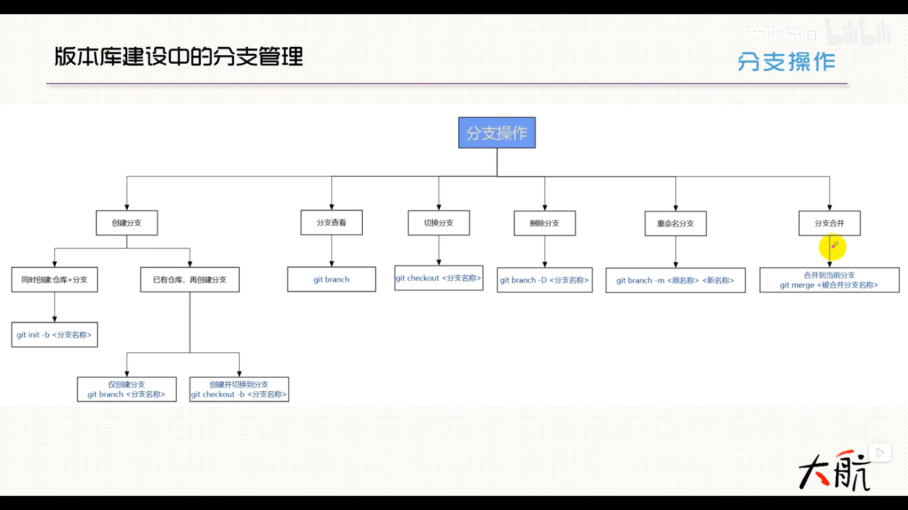

# git reset

git 中 reset 的使用可参考 [Git Reset and Revert Tutorial for Beginners](https://www.datacamp.com/tutorial/git-reset-revert-tutorial)。`git reset` 的主要功能是更改 commit 的提交记录，可分为 `--soft`, `--mixed` 和 `--hard` 三种情况。

例如 `git reset --soft HEAD~1` 会把当前流程图返回到 `HEAD~1` 对应的节点中，同时将之后所有的 commit 移到暂存区中，worksapce 中的更改不会有任何变化。如果是 `--mixed`，则不会把历史提交移到暂存区中，而是直接放到 workspace 中。如果一个文件在提交过后又更改了，那么 `reset --mixed` 之后不会将 workspace 中的文件恢复到之前提交的状态，而是保留当前的更改。`reset --mixed` 的一个应用场景是，commit 之后，发现有个地方写错了，需要重新提交，但是上次的 commit 是好几次之前的，用 `--amend` 无法实现，那么就可以先 `reset --mixed` 到之前的某个版本，再重新提交。`reset --mixed` 也是默认的选项。`reset --hard`则是完全返回到之前的版本，workspace 中的所有更改都会被删除。

有个用法需要注意。比如现在用 models.py 和 utils.py 做了修改，然后把这两个文件 add 到暂存区中，但是突然发现 utils.py 不需要添加，那么一个用法就是 `git reset HEAD utils.py`。如果不写明文件，直接写 `git reset HEAD`，则会将所有暂存区中的文件返回到 worksapce 中。可以这样做的原因是，当前的节点就是 HEAD，因此不会更改 commit 的节点，只会撤销暂存区中的内容。

# git revert

`git revert` 和 `git reset` 的功能差不多，都是撤销之前的 commit，但是不同点在于，reset 只是恢复到之前的某个 commit，而 revert 是创建一个新的 commit，这个新的 commit 和之前的某（几）个 commit 的操作是反过来的。比如说有两个 commit_1 和 commi_2，我如果只想要撤销 commit_1，但是不想撤销 commit_2，用 reset 就没办法直接实现。但是用 revert 就可以用 `git revert commit_1` 创建一个和 commit_1 有着相反操作的 commit，和 commit_1 抵消掉。比方说 commit_1 添加了某行代码，那么新的 commit 就是把原来添加的代码删除掉，并且创建了一个新的节点，commit_2 还保留着。

当把更改 push 到 remote 端的时候，如果是共有分支，提交的时候只能前进，不能后退，否则会很妨碍别人的工作，因此最好用 `git revert` 而不是 `git reset`。但是如果是个人分支的话，想要 commit 的记录变得更简介的话，就可以使用 `git reset`。同时，由于 `git reset` 减少了分支的数量，在 `git push` 的时候，remote 端会发现 commit 记录少了点儿东西，于是无法 push。这个时候就要用 `git push -f` 来让 remote 强制接受更改。当然，这个前提是个人分支，如果是共有分支的话，还是使用 `git revert` 会更好。

# branch management

# git commit --amend

如果先 commit 了一个节点，然后在本地用 `git commit --amend` 更改了最新的 commit，然后再 push 到 remote 上会出现错误。因为 `git commit --amend --no-edit` 更改了最新的 commit，与 remote 上的 commit 不一致，因此无法提交，这个时候可以用 `git push origin main --force` 强制提交。
