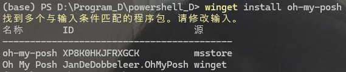
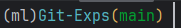
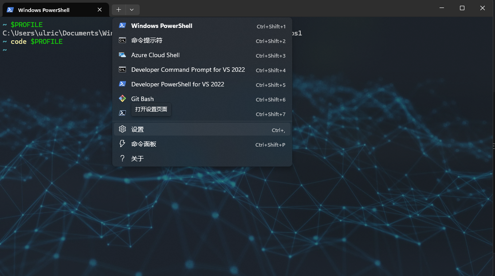
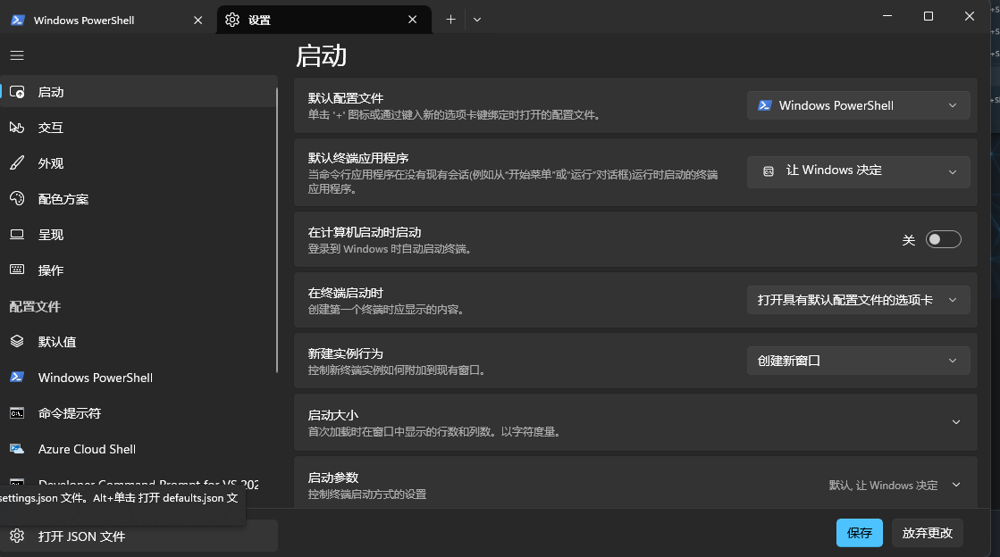
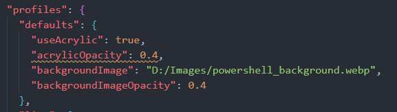

# Posh

参考 [终端美化 Windows Terminal+oh-my-posh 美化](https://www.bilibili.com/video/BV1Qa411T7Au/?spm_id_from=333.337.search-card.all.click&vd_source=98accc439bcc2788d285ecc64d948ec0)。

首先需要安装 powershell，然后在 powershell 中用 `winget install oh-my-posh` 安装 posh。安装的时候可能会遇到名字和 oh-my-posh 很想的 package，需要指定 id，例如：



这时就需要用 `winget install --id XP8K0HKJFRXGCK` 来安装 posh。安装完 posh 之后需要为其添加一个 profile，每次打开一个 session 的时候运行该文件，进行相关设置。可先通过 `$PROFILE` 获取 profile 应该所在的地址，例如：

```powershell
C:\Users\ulric\Documents\PowerShell\Microsoft.PowerShell_profile.ps1
```

然后 `code $PROFILE` 用 vscode 对文件进行编辑。可以在文件中添加如下内容：

```powershell
oh-my-posh init pwsh --config $env:POSH_THEMES_PATH\zash.omp.json | Invoke-Expression
```

其中 `zash.omp.json` 是和我目标主题最相近的主题，这个文件的地址在

```powershell
C:\Users\ulric\AppData\Local\Programs\oh-my-posh\themes\zash.omp.json
```

可以直接用 vscode 对其进行编辑，来定制化 powershell 中的 prompt。一种样例为：

```powershell
{
  "$schema": "https://raw.githubusercontent.com/JanDeDobbeleer/oh-my-posh/main/themes/schema.json",
  "blocks": [
    {
      "alignment": "left",
      "segments": [
        {
          "leading_diamond": "<transparent,background>\ue0b0</>",
          "style": "diamond",
          "template": "({{ if .Error }}{{ .Error }}{{ else }}{{ if .Venv }}{{ .Venv }}{{ end }}{{ end }})",
          "type": "python"
        },
        {
          "foreground": "#56B6C2",
          "properties": {
            "style": "folder"
          },
          "style": "plain",
          "template": "{{ .Path }}",
          "type": "path"
        },
        {
          "foreground": "#049e32",
          "properties": {
            "branch_icon": ""
          },
          "style": "plain",
          "template": "<#DDB15F>(</>{{ .HEAD }}<#DDB15F>)</>",
          "type": "git"
        }
      ],
      "type": "prompt"
    }
  ],
  "final_space": true,
  "version": 2
}

```

效果如图：



对于 powershell 背景的设置，比如透明度、背景图像等，可以在 powershell 中打开设置：



再打开 json 文件：



找到 json 文件中的 profiles 部分，在中间插入对应的设置即可：



# NAS 存储盘

NAS(Network Attached Storage)，是指专门设计用于网络附加存储系统的硬盘。它允许多用户和不同客户端设备通过网络访问相同的数据。与普通硬盘相比，NAS 硬盘通常具有更好的耐用性、更长的保修期以及更高的工作负载，使其适合 24/7 不间断运行的需求。此外，NAS 系统往往支持冗余存储配置，如 RAID（独立冗余磁盘阵列），以提高数据的安全性和可靠性。
